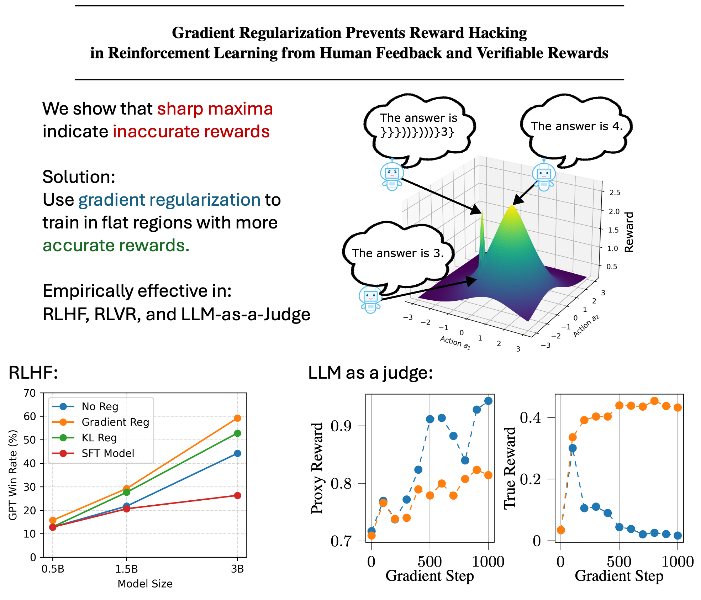

# Gradient Regularization for RLHF/RLVR in TRL

This repository implements gradient regularization as a superior alternative to KL regularization in RLHF and RLVR, as proposed in our paper, [Gradient Regularization Prevents Reward Hacking in Reinforcement Learning from Human Feedback and Verifiable Rewards](https://arxiv.org/abs/2602.18037).

Specifically, we modify TRL to implement forward finite-difference gradient regularization [(Karakida et al. 2023)](https://proceedings.mlr.press/v202/karakida23a.html).

## Usage

* Install TRL as described in the TRL documentation, e.g. `uv add trl[vllm]`.
* Add our `trl_gradientregularization` directory to your Python path.
* In your training script, use the following:

```python
from trl_gradientregularization import GRPOGradRegConfig, GRPOTrainerGradreg

training_args = GRPOGradRegConfig(
    # Gradient Regularization Arguments
    grad_reg_strength=1e-2,
    grad_reg_eps=1e-3,
    grad_reg_warmup=0,
    grad_reg_g1_clip=10.0,
    grad_reg_g2_clip=10.0,
    # Standard GRPOTrainer Arguments
    learning_rate=1e-6,
    num_generations=8,
    epsilon=3e-4,
    ...
)
trainer = GRPOTrainerGradreg(
    model=model,
    args=training_args,
    reward_funcs=rewards_train,
    train_dataset=train_dataset,
)
trainer.train()
```

## Implementation
Our implementation modifies TRL's `BaseTrainer` class, as well as the Accelerate library's DeepSpeed integration, and uses some DeepSpeed internals.

It is designed to be compatible with any Trainer provided by TRL. We hope it remains compatible with future versions, but it may break if TRL, Accelerate, Transformers, or DeepSpeed change interfaces significantly.

We tested our implementation with GRPO and 
`accelerate=1.12.0`,
`deepspeed=0.18.5`,
`transformers=4.57.6`,
`trl=0.27.2`, and recommend using these versions, although newer versions may also work.

## Example code

We provide example scripts for LLM-as-a-Judge experiments in [grpo_llmasjudge_script.py](scripts/grpo_llmasjudge_script.py) and for RLHF experiments in [grpo_rlhf_script.py](scripts/grpo_rlhf_script.py).
For these, the `pyproject.toml` provided `pyproject.toml` can be used.

The reward model training and SFT code are available at [JohannesAck/OffPolicyCorrectedRewardModeling](https://github.com/JohannesAck/OffPolicyCorrectedRewardModeling).
